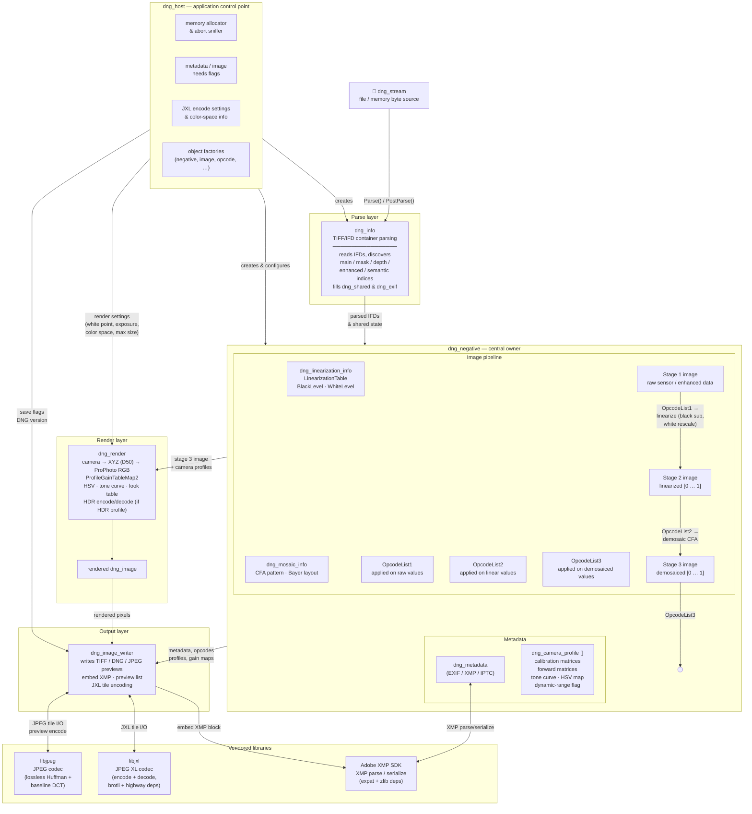

# DNG SDK — Architecture Overview

This diagram shows the major components of the DNG SDK and how they relate to one another. The flow runs from raw file input at the top through parsing, the core pipeline, rendering, and finally to output.



## Component responsibilities

| Component | Responsibility |
|---|---|
| `dng_stream` | Byte-level I/O abstraction over file or memory; all reads/writes go through this |
| `dng_host` | Application control point: memory allocation, abort/progress callbacks, JXL encode settings, object factories for every major type |
| `dng_info` | TIFF/IFD-level parser; discovers main, mask, depth, enhanced, and semantic-mask IFD indices; fills `dng_shared` and `dng_exif` structs |
| `dng_negative` | Central owner of the entire image and metadata state; drives the stage pipeline; owns opcode lists, camera profiles, and all three stage images |
| `dng_linearization_info` | Stores `LinearizationTable`, black-level grid, and white-level used during Stage 1 → Stage 2 conversion |
| `dng_mosaic_info` | CFA / Bayer pattern description; drives demosaic during Stage 2 → Stage 3 |
| `dng_camera_profile` | Per-profile calibration: color matrices, forward matrices, HSV/look tables, tone curve, dynamic-range flag; a `dng_negative` holds a vector of these |
| `dng_render` | Color pipeline: camera-space → XYZ (D50) → ProPhoto RGB, applies `ProfileGainTableMap2`, HSV table, tone curve, and look table; produces a rendered `dng_image` |
| `dng_image_writer` | Serializes a `dng_negative` or `dng_image` to TIFF or DNG; handles JXL tile encoding, JPEG preview encoding, XMP embedding, and preview list |
| **libjpeg** | JPEG codec used for lossless-Huffman raw tiles and baseline-DCT rendered previews |
| **libjxl** | JPEG XL codec (+ brotli + highway SIMD deps) used for JXL-compressed raw/enhanced tiles (DNG ≥ 1.7.0) |
| **Adobe XMP SDK** | XMP metadata parse and serialize (+ expat XML parser + zlib) |

## Stage pipeline

```
Raw file
  └─ Stage 1  raw sensor values (as stored in the file, possibly JXL/JPEG-compressed)
       │  OpcodeList1  (applied to raw integer/float values)
       │  LinearizationTable LUT (optional)
       │  Black-level subtraction  (BlackLevel + delta grids)
       │  White-level rescale  → [0.0, 1.0]
       ▼
     Stage 2  linearized scene-referred values
       │  OpcodeList2  (warp, gain, bad-pixel correction on linear values)
       │  Demosaic CFA  (if Bayer/X-Trans mosaic input)
       ▼
     Stage 3  demosaiced linear values
       │  OpcodeList3  (applied after demosaic)
       ▼
     dng_render  camera → XYZ → ProPhoto → tone/HSV/look → output color space
       ▼
     Rendered image  (ready to write as TIFF or embed in output DNG)
```
