# DNG File Read — Workflow Diagram

This diagram traces the exact sequence of API calls used to read a DNG file into
the SDK pipeline, as implemented in `dng_validate.cpp`. Decision diamonds show
the conditional branches driven by what IFDs are present in the file.

```mermaid
flowchart TD
    START([Start]) --> HOSTCFG

    HOSTCFG["① Configure dng_host\n─────────────────────\nSet preferred / min / max size\nSet JXL encode flags\nSet ignore-enhanced flag\nSet save-DNG version"]

    HOSTCFG --> STREAM["② Open dng_stream\nfrom file path"]

    STREAM --> INFOPARSE["③ dng_info::Parse(host, stream)\n─────────────────────────────\nRead TIFF header (magic 42/43)\nWalk all IFDs + SubIFDs\nFill dng_ifd objects\nFill dng_shared (DNGVersion,\nDNGBackwardVersion, …)\nFill dng_exif"]

    INFOPARSE --> INFOPOST["④ dng_info::PostParse(host)\n────────────────────────────\nResolve IFD roles by NewSubFileType:\n  fMainIndex (raw image)\n  fMaskIndex (transparency)\n  fDepthIndex (depth map)\n  fEnhancedIndex (demosaiced)\n  fSemanticMaskIndices[]"]

    INFOPOST --> VALID{"IsValidDNG()?"}
    VALID -->|No| ERR([Throw dng_exception\nor return error])
    VALID -->|Yes| MAKENEG

    MAKENEG["⑤ host.Make_dng_negative()\nAllocate dng_negative object"]

    MAKENEG --> NEGPARSE["⑥ negative->Parse(host, stream, info)\n──────────────────────────────────────\nRead camera profile tags\n  (ColorMatrix, ForwardMatrix,\n   CameraCalibration, …)\nRead OpcodeList1/2/3 blobs\nRead LinearizationInfo\n  (LinearizationTable, BlackLevel,\n   WhiteLevel, BlackLevelDeltaH/V)\nRead MosaicInfo (CFAPattern)\nRead AsShotNeutral / AsShotWhiteXY\nRead EXIF / XMP / IPTC metadata\nRead ImageSequenceInfo, ImageStats\nRead ProfileGainTableMap2\nRead ProfileDynamicRange"]

    NEGPARSE --> NEGPOST["⑦ negative->PostParse(host, stream, info)\n──────────────────────────────────────────\nResolve camera calibration signatures\nFinalize profile list\nValidate tag combinations"]

    NEGPOST --> ENHCHECK{"fEnhancedIndex ≥ 0\nAND NOT IgnoreEnhanced?"}

    ENHCHECK -->|Yes| READENHANCED["⑧a negative->ReadEnhancedImage\n(host, stream, info)\n────────────────────────────\nRead demosaiced LinearRaw\nIFD pixels into Stage 1\n(already linear, no CFA)"]

    ENHCHECK -->|No| READSTAGE1["⑧b negative->ReadStage1Image\n(host, stream, info)\n────────────────────────────\nRead main IFD pixels\n(may be uncompressed,\nlossless JPEG, deflate,\nlossy JPEG, or JPEG XL)\nDecompress if needed\n(libjpeg / libjxl)"]

    READENHANCED --> MASKCHECK
    READSTAGE1   --> MASKCHECK

    MASKCHECK{"fMaskIndex ≥ 0?"}
    MASKCHECK -->|Yes| READMASK["⑨ negative->ReadTransparencyMask\n(host, stream, info)"]
    MASKCHECK -->|No| DEPTHCHECK
    READMASK --> DEPTHCHECK

    DEPTHCHECK{"fDepthIndex ≥ 0?"}
    DEPTHCHECK -->|Yes| READDEPTH["⑩ negative->ReadDepthMap\n(host, stream, info)"]
    DEPTHCHECK -->|No| SEMCHECK
    READDEPTH --> SEMCHECK

    SEMCHECK{"fSemanticMaskIndices\nnot empty?"}
    SEMCHECK -->|Yes| READSEM["⑪ negative->ReadSemanticMasks\n(host, stream, info)"]
    SEMCHECK -->|No| VALIDATE
    READSEM --> VALIDATE

    VALIDATE["⑫ negative->ValidateRawImageDigest(host)\nVerify NewRawImageDigest / RawImageDigest\n(SHA-1 or MD5 of compressed tile data)"]

    VALIDATE --> SYNCMETA["⑬ negative->SynchronizeMetadata()\nMerge EXIF ↔ XMP\nResolve orientation, date-time,\ncopyright, GPS from both sources\nFinalise metadata for downstream use"]

    SYNCMETA --> STAGE1CHECK{"Stage1Image\npresent?"}

    STAGE1CHECK -->|Yes| BUILD2["⑭ negative->BuildStage2Image(host)\n──────────────────────────────\n1. Apply OpcodeList1 (on raw values)\n2. Apply LinearizationTable LUT\n3. Subtract BlackLevel\n   (+ BlackLevelDeltaH/V grids)\n4. Rescale to [0.0, 1.0]\n   using WhiteLevel\n5. Apply OpcodeList2\n   (warp, gain, bad-pixel)"]

    STAGE1CHECK -->|No| RESIZE_NOTRANS

    BUILD2 --> STAGE2CHECK{"Stage2Image\npresent?"}

    STAGE2CHECK -->|Yes| BUILD3["⑮ negative->BuildStage3Image(host)\n──────────────────────────────\nDemosaic CFA / Bayer data\n(AHD or other algorithm)\nApply OpcodeList3\n(on demosaiced values)"]

    STAGE2CHECK -->|No| RESIZE_NOTRANS["Resize transparency / depth\nto match Stage 3 bounds\n(no-op path if no CFA)"]

    BUILD3 --> RESIZETRANS["⑯ ResizeTransparencyToMatchStage3\n    ResizeDepthToMatchStage3"]
    RESIZETRANS --> RESIZESEM

    RESIZE_NOTRANS --> RESIZESEM

    RESIZESEM["⑰ ResizeSemanticMasksToMatchStage3"]

    RESIZESEM --> PROXYCHECK{"Proxy DNG\nrequested?"}

    PROXYCHECK -->|Yes| PROXY["ConvertToProxy(host, writer, size)\nDownsample + re-encode as proxy DNG"]
    PROXYCHECK -->|No| JXLCHECK

    PROXY --> FLATCHECK

    JXLCHECK{"LossyMosaicJXL\nrequested?"}
    JXLCHECK -->|Yes| LOSSYJXL["LossyCompressMosaicJXL\n(host, writer)"]
    JXLCHECK -->|No| LOSSLESSJXLCHECK
    LOSSYJXL --> LOSSLESSJXLCHECK

    LOSSLESSJXLCHECK{"LosslessJXL\nrequested?"}
    LOSSLESSJXLCHECK -->|Yes| LLJXL["LosslessCompressJXL\n(host, writer)"]
    LOSSLESSJXLCHECK -->|No| FLATCHECK
    LLJXL --> FLATCHECK

    FLATCHECK{"NeedFlattenTransparency?"}
    FLATCHECK -->|Yes| FLAT["FlattenTransparency(host)\nComposite alpha over background"]
    FLATCHECK -->|No| DONE

    FLAT --> DONE

    DONE(["⑱ Negative fully loaded\nReady for dng_render\nor dng_image_writer"])

    style ERR fill:#f88,color:#000
    style DONE fill:#8d8,color:#000
    style START fill:#aaf,color:#000
```

## Call sequence summary

| Step | Call | What it does |
|---|---|---|
| ① | `dng_host` configure | Set size hints, JXL flags, enhanced/ignore flags |
| ② | `dng_stream` open | Byte-level I/O over the file |
| ③ | `info.Parse(host, stream)` | Walk TIFF/IFD tree; fill `dng_ifd` + `dng_shared` + `dng_exif` |
| ④ | `info.PostParse(host)` | Resolve IFD roles by `NewSubFileType`; set main/mask/depth/enhanced/semantic indices |
| ⑤ | `host.Make_dng_negative()` | Allocate the `dng_negative` |
| ⑥ | `negative->Parse(host, stream, info)` | Read all metadata tags: camera profiles, opcode blobs, linearization, mosaic, EXIF, XMP |
| ⑦ | `negative->PostParse(host, stream, info)` | Finalise calibration signatures, validate tag combinations |
| ⑧a | `negative->ReadEnhancedImage(...)` | Read already-demosaiced LinearRaw IFD (if present and not ignored) |
| ⑧b | `negative->ReadStage1Image(...)` | Read main raw IFD; decompress JXL/JPEG/deflate tiles into Stage 1 image |
| ⑨ | `negative->ReadTransparencyMask(...)` | Read alpha/transparency IFD (if present) |
| ⑩ | `negative->ReadDepthMap(...)` | Read depth-map IFD (if present) |
| ⑪ | `negative->ReadSemanticMasks(...)` | Read semantic-mask IFDs (if any) |
| ⑫ | `negative->ValidateRawImageDigest(host)` | Verify SHA-1/MD5 digest of raw tile data |
| ⑬ | `negative->SynchronizeMetadata()` | Merge EXIF ↔ XMP; finalise orientation, date-time, GPS |
| ⑭ | `negative->BuildStage2Image(host)` | OpcodeList1 → linearization LUT → black subtract → white rescale → OpcodeList2 |
| ⑮ | `negative->BuildStage3Image(host)` | Demosaic CFA → OpcodeList3 |
| ⑯–⑰ | `Resize*ToMatchStage3(host)` | Scale transparency, depth, semantic masks to Stage 3 bounds |
| ⑱ | — | Negative is fully loaded; pass to `dng_render` or `dng_image_writer` |

## Key branching rules

- **Enhanced IFD** (`NewSubFileType = 16`): if present and `IgnoreEnhanced` is not set, the SDK reads the pre-demosaiced image as Stage 1 and skips the CFA demosaic step — Stage 3 will be identical to Stage 2.
- **Transparency mask** (`NewSubFileType = 4`): read if `fMaskIndex ≥ 0`; resized to match Stage 3 after demosaic.
- **Depth map** (`NewSubFileType = 8`): read if `fDepthIndex ≥ 0`; same resize rule.
- **Semantic masks** (`NewSubFileType = 0x10004`): zero or more; all resized to match Stage 3.
- **AsShotNeutral vs AsShotWhiteXY**: mutually exclusive per spec — only one should be present in IFD 0.
